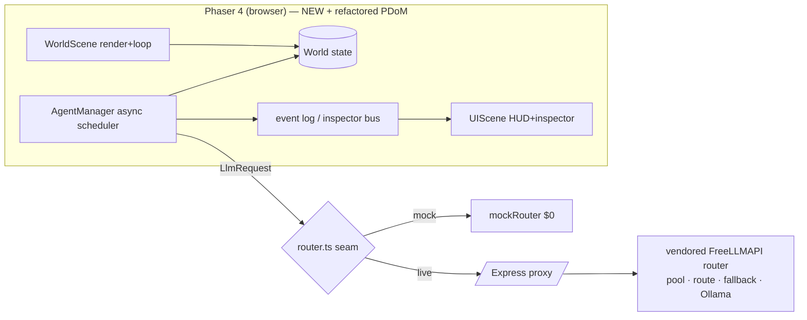

# Harvest of Madness — Standalone Project Build Plan

**Strategy:** borrow + refactor from *Petri Dish of Madness* and *FreeLLMAPI*, write only the new farming engine fresh.
**Working title:** Harvest of Madness (repo: `HarvestOfMadness`) · *alt: Madow Valley*
**Concept:** A tiny, self-running Stardew-style farming sim where every character is driven by a real LLM. No human player — you watch AI "specimens" farm, trade, and bicker. The farming sibling to *Petri Dish of Madness*, sharing its router/model plumbing and instrumentation DNA, but rebuilt on a **fully async** agent model (no global tick barrier) and a 2D engine.
**Purpose:** (1) a standalone testbed for the async AI-world architecture, and (2) a strong exercise for Fable 5 on the new/refactor glue.

---

## 0. Posture — standalone, assembled by vendor-and-refactor

- **Own repo, own deps, own version.** HoM does **not** depend on PDoM or FreeLLMAPI at runtime. It **copies (vendors) proven modules in and refactors them** to fit. The source repos can change freely afterward — no coupling.
- **Build harness:** **Claude Code** for the borrow/refactor phases (it reads both source repos and refactors against target interfaces). **Fable 5** as the model + author of the greenfield farming engine.
- **One-shot variant:** if you'd rather keep this a clean Fable-5 one-shot test, swap "vendor the real file" for "reimplement this module's logic from scratch to the same interface." The interfaces in §5/§9/§11 are identical either way, so the plan doesn't change — only whether code is lifted or rewritten.
- **Provenance is tracked** (`PROVENANCE.md`) and licenses preserved — see §15.

---

## 1. Assumptions (stated so we don't block)

- **"1x1" = minimum complete vertical slice**, not a literal one-tile map. One contiguous map (farm + shop), one full loop (till → plant → water → sleep → harvest → sell), 2–3 agents. Smallest thing that's *actually playable end to end*.
- **Pure AI spectator sim.** No human input to gameplay; humans only pause/step/inspect.
- **Async, eventual-consistency agents.** Each agent runs its own loop; decisions are fire-and-forget LLM calls validated against *current* world state when they return. This is the deliberate refactor away from PDoM's synchronized ticks.
- **2D top-down, Phaser 4.** Stardew is inherently 2D. (R3F parity is the one real fork — §16.)
- **Free/clean assets only.** No ripped Stardew art. See §12.

---

## 2. Scope

**In (v1):** single tilemap (~24×18, 16px tiles) with tillable soil, water, farmhouse+bed, shop, paths/grass, walls · day/phase clock + day advance via sleep · farming (till/plant/water/grow/harvest) · economy (gold, shop buy/sell) · 2–3 LLM-driven personas with A* movement + energy · sense→think→act loop with structured JSON · per-agent inspector + event log + clock · `mock`/`live` model modes · cost controls (in-flight cap, cooldown, daily ceiling, pause/step).

**Out (v1) → stubs/§17:** combat, fishing, mining, foraging, festivals, weather, seasons, multiple maps, save UI, agent trading, romance.

---

## 3. Provenance & Refactor Map (the centerpiece)

> Target shapes inferred from project memory — **confirm against the actual repos**; §End offers to turn this into exact file-by-file lift instructions if you paste the trees.

| Source | Module (what it does) | → Refactor target in HoM | Refactor delta | Effort |
|---|---|---|---|---|
| **FreeLLMAPI** | Provider pool (~16 free tiers) + model selection/routing | `server/llm/pool.ts`, `server/llm/route.ts` | Wrap behind `Router`/`LlmRequest`/`LlmResponse` (§11). Move server-side so keys never hit the client. Strip any PDoM-specific coupling. | **Lift, light** |
| **FreeLLMAPI** | Fallback/retry + Ollama local support | `server/llm/fallback.ts` | Keep as-is; expose `model` + `latencyMs` in the normalized response. | **Lift, ~as-is** |
| **FreeLLMAPI** | Rate limiting / token accounting | `server/llm/limits.ts` | Reuse; surface `tokensIn/out` to the inspector; feed the §6 daily ceiling. | **Lift, light** |
| **FreeLLMAPI** | Response normalization / JSON extraction | `server/llm/parse.ts` | Reuse; tighten to emit a parsed `AgentAction` (§4.3) when valid. | **Lift, light** |
| **Petri Dish of Madness** | Agent decision pipeline (sense→think→act) | `src/agents/AgentRuntime.ts` | **Remove the synchronized tick barrier.** Convert to per-agent async loop driven by the scheduler (§6). Keep the structured-output parse + prompt-builder pattern. | **Lift, heavy** |
| **Petri Dish of Madness** | Agent scheduler / world clock | `src/agents/AgentManager.ts` | Replace global-tick scheduling with in-flight cap + per-agent cooldown queue. | **Refactor, heavy** |
| **Petri Dish of Madness** | Prompt builders + persona handling | `src/llm/prompts.ts`, `src/agents/personas.ts` | Keep structure; swap world rules + action schema for farming (§4). | **Lift, medium** |
| **Petri Dish of Madness** | Observability / decision-trace inspector | `src/obs/*`, `scenes/UIScene.ts` | Keep the event-log + decision-trace **data model**; re-skin panels from R3F → Phaser 2D HUD. | **Lift, medium** |
| **Petri Dish of Madness** | `.pdom` session bundle (zip + manifest) | `src/obs/session.ts` → `.hom` | Same zip/manifest/SIGTERM-export pattern, farming snapshot schema. (§17 stretch.) | **Lift, light** |
| **— new (no source) —** | Phaser 2D engine, Grid/Tile/Crop/Economy, A* pathfinding, farming `Observation`/`ActionSchema`/`ActionExecutor` | `src/world/*`, `src/agents/Action*.ts`, `src/agents/Observation.ts`, scenes | Greenfield — Fable 5's strength. | **New** |

**Net:** the router and the agent/observability machinery are borrowed; the **2D world + the farming-specific contract** are new; the **async scheduler** is the one heavy *refactor* of borrowed code.

---

## 4. The Agent Contract (new — farming-specific; this is the seam the borrowed pipeline drives)

### 4.1 Sense — `Observation`
```ts
interface Observation {
  self: { name:string; persona:string; role:string;
          pos:{x:number;y:number}; energy:number; gold:number;
          inventory:{itemId:string;qty:number}[]; goal:string|null; };
  time: { day:number; phase:"morning"|"afternoon"|"evening"|"night" };
  nearby: {
    tiles:{x:number;y:number;type:TileType;
           crop?:{kind:string;stage:number;watered:boolean;ready:boolean}}[]; // radius ~4
    agents:{name:string;pos:{x:number;y:number};lastSeenDoing:string}[];
    landmarks:{kind:"shop"|"bed"|"water"|"house";pos:{x:number;y:number}}[];
  };
  lastAction:{action:string;ok:boolean;reason?:string}|null;  // feedback for self-correction
  availableActions: ActionType[];
  economy:{sells:Record<string,number>;buys:Record<string,number>};
}
```

### 4.2 Think — prompt contract
- **System:** persona + concise world rules + action schema + **"Respond with ONLY one JSON object — no prose, no fences."**
- **User:** `JSON.stringify(observation)` + "What do you do next?"
- Use structured-output mode where the provider supports it; always parse defensively (strip fences, take first `{...}`). Borrowed `parse.ts` handles the extraction.

### 4.3 Act — `AgentAction`
```ts
type ActionType = "MOVE_TO"|"TILL"|"PLANT"|"WATER"|"HARVEST"
                |"BUY"|"SELL"|"TALK_TO"|"SLEEP"|"WAIT";
interface AgentAction {
  thought:string; say:string|null; action:ActionType;
  target?: {x:number;y:number} | {itemId:string;qty:number} | {agentName:string};
  goal?:string;
}
```

### 4.4 Validation (`ActionExecutor`) — reject loudly, never crash
| Action | Preconditions | Effect |
|---|---|---|
| MOVE_TO | passable & reachable | A* path; walk over frames |
| TILL | adjacent; untilled soil; energy>0 | tilled; −energy |
| PLANT | adjacent; tilled & empty; has seed | crop stage 0; −seed; −energy |
| WATER | adjacent; has crop; not watered | watered=true; −energy |
| HARVEST | adjacent; crop ready | +crop; clear tile; −energy |
| BUY/SELL | at shop; gold/has item | exchange |
| TALK_TO | within 1 tile | speech bubbles; relationship+1; (live: optional 1-shot reply) |
| SLEEP | at bed; phase=night | next morning; restore energy; watered crops +1 stage; reset watering |
| WAIT | always | idle one cooldown |

Failed precondition → `lastAction.ok=false` + readable `reason`, surfaced next observation.

---

## 5. Architecture & seams



**Three seams where borrowed code plugs in:**
1. **`Router`** (§11) — FreeLLMAPI conforms to this; client never imports it directly.
2. **`AgentRuntime`/scheduler** (§6) — refactored PDoM pipeline conforms to the async scheduler API.
3. **`Inspector` data model** (§9) — refactored PDoM observability feeds the Phaser HUD.

New code consumes these seams; borrowed code is shaped *to* them.

---

## 6. Async scheduling & cost control (refactor PDoM tick → per-agent loop)

- **No global tick.** Each agent FSM: `IDLE → THINKING(await LLM) → EXECUTING(multi-frame action) → IDLE`. The world never blocks on a decision.
- **Global in-flight cap** `MAX_CONCURRENT_DECISIONS=3` (queue overflow).
- **Per-agent cooldown** `DECISION_COOLDOWN_MS` (mock ~2500, live ~6000+); request only when current action done + cooldown elapsed.
- **Hard ceiling** `MAX_DECISIONS_PER_DAY` kill-switch → fall back to mock heuristic + "budget reached" badge.
- **Pause / Step / Speed**; optional identical-observation decision cache (off by default); prompt-size caps.

---

## 7. World & mechanics (new)

- **Tiles:** `grass|path|water|tilled|soil|building|bedTile|shopTile|wall`.
- **Crops (v1):** parsnip (4d, 20/35), potato (6d, 50/80), cauliflower (8d, 80/175). Stage advances on SLEEP only if watered that day.
- **Time:** phases gate behavior; SLEEP advances the calendar day.
- **Energy:** 100 start; field actions ~2–5; 0 → can only walk to bed / WAIT.
- **Economy:** price tables in `Economy.ts`; BUY/SELL at shop only.
- **Emergent objective:** maximize gold / expand cultivation; optional soft win at 1000g; else open-ended.

---

## 8. Observability (refactor PDoM inspector → Phaser HUD)

Per-agent card: name · persona · gold · energy · goal · **last thought** · last action + ok/fail · **model · latency · tokens** · decisions count · expandable **decision trace** (raw observation + raw response). Plus a global timestamped **event-log ring buffer** and clock/day readout; speech bubbles over sprites. Keep PDoM's data model; redraw the surface.

---

## 9. Personas (borrow PDoM's persona pattern)

`personas.ts`: **Diligent Dora** (methodical optimizer), **Reckless Rusty** (plants cheap, forgets to water, overspends), **Social Sage** (prioritizes TALK_TO + wandering). Same engine, visibly different emergent play — the legible test signal and a clean Fable-5 steering probe.

---

## 10. (reserved)

---

## 11. Router seam (where vendored FreeLLMAPI lands)

```ts
// src/llm/router.ts  (client-side seam)
export interface LlmRequest { agentId:string; system:string; user:string; jsonSchema?:object; }
export interface LlmResponse { raw:string; parsed?:AgentAction; model:string;
                               latencyMs:number; tokensIn?:number; tokensOut?:number; error?:string; }
export type Router = (req:LlmRequest)=>Promise<LlmResponse>;
export const mockRouter: Router;   // built-in heuristic farmer, $0, deterministic
export const liveRouter: Router;   // POST /api/agent/complete -> Express proxy -> vendored FreeLLMAPI
export function getRouter(): Router; // switch on import.meta.env.VITE_MODEL_MODE
```
- `mockRouter` returns valid `AgentAction`s so the whole game runs and is judgeable before any token is spent.
- `liveRouter` hits the Express proxy (`server/`) wrapping the vendored FreeLLMAPI router. **Keys live only in `server/`.** The vendored router is shaped to return `{raw,model,latencyMs,tokensIn?,tokensOut?}`.

---

## 12. Assets (license-clean; no Stardew rips)

Default **CC0** for zero friction: **Kenney** (`kenney.nl`, CC0) 16×16 top-down/RPG tiles + simple character — commit freely. Alt: **LPC** (OpenGameArt, CC-BY-SA/GPL, keep license file). **Sprout Lands** (Cup Nooble, itch.io) is the closest cozy aesthetic and has a free *basic* pack, but its license is more restrictive and access has changed historically — fine for a personal prototype, **read terms, don't redistribute raw assets, don't assume commercial rights.** Never use real Stardew art.
**Fallback (so the build never blocks on art):** with no pack in `public/assets/`, render tiles as colored rects and agents as labeled circles via Phaser Graphics. Game must be fully playable with **zero image files**; art is a swap-in.

---

## 13. Repo structure

```
HarvestOfMadness/
  index.html  package.json  tsconfig.json  vite.config.ts  .env.example
  README.md  PROVENANCE.md                 # borrowed-file → origin + refactor notes
  vendor/                                   # raw lifted modules pre-refactor (optional staging)
  public/assets/                            # optional art; placeholder-graphics fallback in code
  src/
    main.ts  config.ts  world.ts            # bootstrap, constants, code-gen tilemap
    scenes/  BootScene.ts  WorldScene.ts  UIScene.ts
    world/   Grid.ts  Tile.ts  TimeSystem.ts  Economy.ts  Pathfinding.ts   # NEW
    agents/  Agent.ts  AgentManager.ts  AgentRuntime.ts                    # refactored PDoM
             Observation.ts  ActionSchema.ts  ActionExecutor.ts  personas.ts # NEW + borrowed
    llm/     router.ts  prompts.ts          # seam + borrowed prompt pattern
    obs/     EventLog.ts  Inspector.ts  session.ts   # refactored PDoM
  server/                                   # live mode only
    index.ts                                # Express proxy
    llm/  pool.ts  route.ts  fallback.ts  limits.ts  parse.ts  # vendored FreeLLMAPI, refactored
```

---

## 14. Build order (borrow → conform → de-PDoM-ify → integrate)

Each phase must run on its own.

0. **Scaffold** standalone repo (Phaser 4 Vite+TS template); create `PROVENANCE.md`.
1. **Router first.** Vendor FreeLLMAPI into `server/llm/*`; conform to the `Router` interface; keep `mockRouter`. Verify live path with a curl test, mock path with a unit call. *(Borrow, light.)*
2. **New world engine.** Grid/Tile/TimeSystem/Economy/Pathfinding + placeholder render + HUD clock. Drive a scripted till→plant→water→sleep→harvest→sell to prove the loop. *(New.)*
3. **Vendor + refactor the agent pipeline.** Lift PDoM's sense→think→act + scheduler into `AgentRuntime`/`AgentManager`; **strip the tick barrier**, make it async per §6; adapt to the farming `Observation`/`ActionSchema`; drive agents via `mockRouter`. **← MVP: self-running farm, $0.** *(Refactor, heavy.)*
4. **Vendor + refactor observability.** PDoM inspector/event-log data model → Phaser `UIScene` cards + log + pause/step/speed. *(Borrow, medium.)*
5. **Live + personas + polish.** `VITE_MODEL_MODE=live`; 3 personas; speech bubbles; energy pressure.
6. **Stretch (§17).**

If room runs out, stopping after **Phase 4** yields a complete, impressive, $0 demo.

---

## 15. Vendoring hygiene & licenses

- **`PROVENANCE.md`** maps every borrowed file → source repo + commit + refactor summary.
- Keep an optional `vendor/` staging copy of raw lifts so the refactor delta is reviewable in git.
- **Licenses:** preserve any license headers from FreeLLMAPI's provider SDKs/deps; if any vendored module carries a third-party license, copy it in and note it in `PROVENANCE.md`. Your own code (PDoM, your router) — set HoM's own license deliberately (you've got the LLC/IP track for this).

---

## 16. The one real fork

- **A) Phaser 2D (default).** Best Stardew fit; cleanest refactor target; distinct from PDoM.
- **B) R3F/Three.js 2.5D** to share engine + assets with PDoM (less to vendor on the render side, but heavier and riskier). The agent contract, async model, router seam, and observability (§4/§6/§9/§11) transfer unchanged; only §5/§13 render/scaffold change. Say the word and I'll re-issue those.

---

## 17. Stretch / v2 hooks

`.hom` session bundle (lift `.pdom` pattern) · session replay scrubber · agent-to-agent trading + multi-turn dialogue · weather/seasons/second map · analytics dashboard (gold-over-time per persona, decisions/day, model-mix, latency/cost) = a direct Fable-5-vs-others benchmark surface.

---

## 18. Definition of done

- [ ] `npm install && npm run dev` boots a playable window with no setup.
- [ ] **Mock mode:** 2–3 agents autonomously run the full loop across multiple days; gold changes; no crashes.
- [ ] **Live mode** (`VITE_MODEL_MODE=live` + `server/`) routes decisions through the vendored FreeLLMAPI router; invalid actions rejected with feedback, not crashes.
- [ ] **No API keys in the client bundle.**
- [ ] Inspector shows goal/thought/action/model/latency; event log populates; pause/step/speed work.
- [ ] Cost controls present (in-flight cap, cooldown, daily ceiling).
- [ ] Runs with **zero external art**; art is a clean swap-in.
- [ ] `PROVENANCE.md` accounts for every borrowed module.

---

### Kickoff prompt (Claude Code)

> Build **Harvest of Madness** as a standalone repo using vendor-and-refactor. Read the source repos for *FreeLLMAPI* and *Petri Dish of Madness*. Follow §14 phase order: (1) vendor FreeLLMAPI's router into `server/llm/*` behind the `Router` interface (§11), keeping the built-in `mockRouter` as the $0 default; (2) write the new Phaser 4 + Vite + TS 2D farming engine (§7) with a code-gen tilemap and placeholder-graphics fallback so it runs with no art; (3) vendor + refactor PDoM's agent pipeline into an **async per-agent scheduler — strip the synchronized tick barrier** — adapted to the farming agent contract (§4); (4) vendor + refactor PDoM's observability into the Phaser inspector + event log; (5) wire live mode + 3 personas. Honor every interface in §4/§6/§9/§11 exactly. Maintain `PROVENANCE.md` mapping each borrowed file to its origin and refactor. Stop only at phase boundaries; it must boot and self-run in mock mode first.